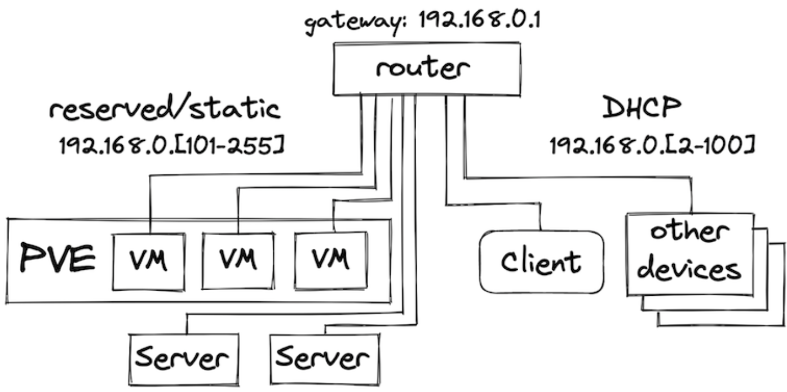
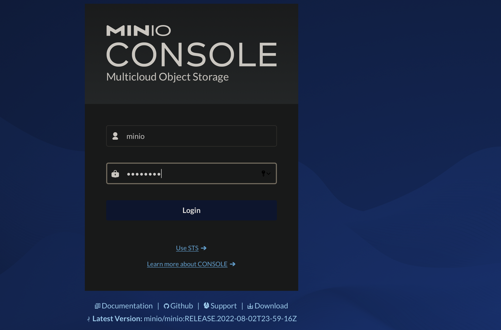
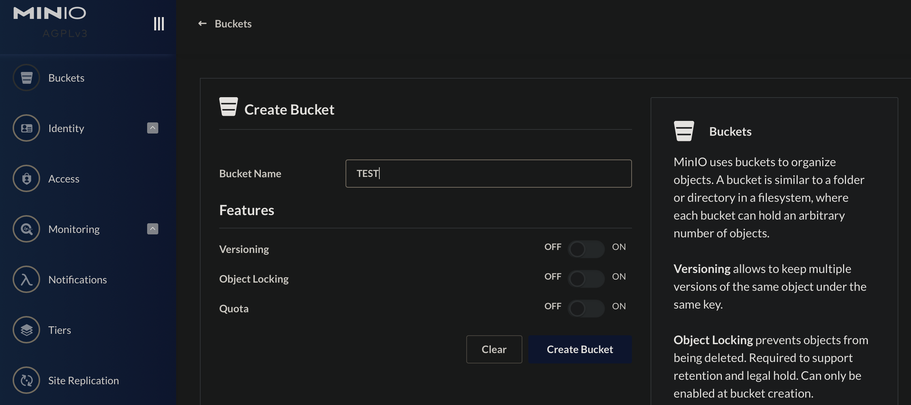

# Build your own kubernetes cluster on proxmox

- source https://datastrophic.io/kubernetes-homelab-with-proxmox-kubeadm-calico-openebs-and-metallb/

I want to be able to spin up a K8s lab on local infrastucture with little to no hassle. This repo should help get this done. 

## Contents 
- create a proxmox vm template that can be used in provsioning to build new infrastructure as required. 
- provision the vms in proxmox
- on premise kubernetes deployment 

## Overview
This repository contains a reference implementation of bootstrapping and installation
of a Kubernetes cluster on-premises. The provided tooling can be used both as a basis
for personal projects and for educational purposes.

The goal of the project is to provide tooling for reproducible deployment of a fully
functional Kubernetes cluster for on-premises including support for dynamic
provisioning of `PersistentVolumes` an `LoadBalancer` service types.

Software used:
* `Ansible` for deployment automation
* `kubeadm` for Kubernetes cluster bootstrapping
* `containerd` container runtime
* `Calico` for pod networking
* `MetalLB` for exposing `LoadBalancer` type services
* `OpenEBS` for volume provisioning
* `Istio` for ingress and traffic management 

## Pre-requisites
* cluster machines/VMs should be provisioned and accessible over SSH
* it is recommended to use Ubuntu 20.04 as cluster OS - at the time of writing
* the current user should have superuser privileges on the cluster nodes
* Ansible installed locally

## Bootstrapping the infrastructure on Proxmox
The [proxmox](proxmox) directory of this repo contains automation for the initial
infrastructure bootstrapping using `cloud-init` templates and Proxmox Terraform provider.

# Quickstart
Installation consists of the following phases:
* prepare machines for Kubernetes installation
  * install common packages, disable swap, enable port forwarding, install container runtime
* Kubernetes installation
  * bootstrap control plane, install container networking, bootstrap worker nodes

* Edit the inventory.yaml file to fit your setup. 
* Plus make sure you know the ubuntu password for k8s hosts
* ansible_user added to the inventory.yaml

To prepare machines for Kubernetes installation, run:
```
ansible-playbook -i ansible/inventory.yaml ansible/bootstrap.yaml  -K -vvv
```
> **NOTE:** the bootstrap step usually required to run only once or when new nodes joined.

To install Kubernetes, run:
```
ansible-playbook -i ansible/inventory.yaml ansible/kubernetes-install.yaml -K
```
Once the playbook run completes, a kubeconfig file `admin.conf` will be fetched to the current directory. To verify
the cluster is up and available, run:
```
$> kubectl --kubeconfig=admin.conf get nodes
NAME                          STATUS   ROLES                  AGE     VERSION
control-plane-0.k8s.cluster   Ready    control-plane,master   4m40s   v1.21.6
worker-0                      Ready    <none>                 4m5s    v1.21.6
worker-1                      Ready    <none>                 4m5s    v1.21.6
worker-2                      Ready    <none>                 4m4s    v1.21.6
```
To uninstall Kubernetes, run:
```
ansible-playbook -i ansible/inventory.yaml ansible/kubernetes-reset.yaml -K
```
## Essential Software 

With the Kubernetes cluster up and running we now can deploy and run containers on it. However, a couple of essential parts of the fully-functional cluster are still missing: the dynamic volume provisioning and the support for Services with LoadBalancer type.

### Persistent volumes with EBS
There is a plenty of storage solutions on Kubernetes. At the moment of writing,
[OpenEBS](https://openebs.io/) looked like a good fit for having storage installed
with minimal friction.

For the lab setup, a [local hostpath](https://openebs.io/docs/user-guides/localpv-hostpath)
provisioner should be sufficient, however, OpenEBS provides multiple options for
a replicated storage backing Persistent Volumes.

To use only host-local Persistent Volumes, it is sufficient to install a lite
version of OpenEBS:

```
kubectl apply -f https://openebs.github.io/charts/openebs-operator-lite.yaml
```

Once the Operator is installed, create a `StorageClass` and annotate it as **default**:
```
kubectl apply -f - <<EOF
apiVersion: storage.k8s.io/v1
kind: StorageClass
metadata:
  name: openebs-hostpath
  annotations:
    storageclass.kubernetes.io/is-default-class: "true"
    openebs.io/cas-type: local
    cas.openebs.io/config: |
      - name: StorageType
        value: "hostpath"
      - name: BasePath
        value: "/var/openebs/local/"
provisioner: openebs.io/local
volumeBindingMode: WaitForFirstConsumer
reclaimPolicy: Delete
EOF
```

To verify OpenEBS Local PV provisioner is running, execute the following command. Replace -n openebs with the namespace where you installed OpenEBS.
```bash
kubectl get pods -n openebs -l openebs.io/component-name=openebs-localpv-provisioner
```

To verify OpenEBS Local PV Hostpath StorageClass is created, execute the following command.

```bash
kubectl get sc
```

#### Create a PersistentVolumeClaim

[Source](https://openebs.io/docs/user-guides/localpv-hostpath#install-verification)

The next step is to create a PersistentVolumeClaim. Pods will use PersistentVolumeClaims to request Hostpath Local PV from OpenEBS Dynamic Local PV provisioner.

Apply the manifest `deployment/openebs/ocal-hostpath-pvc.yaml` to create the persistant volume claim. 

Look at the PersistentVolumeClaim: `kubectl get pvc local-hostpath-pvc`

The output shows that the STATUS is Pending. This means PVC has not yet been used by an application pod. The next step is to create a Pod that uses your PersistentVolumeClaim as a volume.

Here is the configuration file for the Pod that uses Local PV `deploment/opnebs/ local-hostpath-pod.yaml`

Create the pod  `kubectl apply -f local-hostpath-pod.yaml`. Verify that the container in the Pod is running. `kubectl get pod hello-local-hostpath-pod`.

Verify that the data is being written to the volume. `kubectl exec hello-local-hostpath-pod -- cat /mnt/store/greet.txt`

Verify that the container is using the Local PV Hostpath. `kubectl describe pod hello-local-hostpath-pod`

Look at the PersistentVolumeClaim again to see the details about the dynamically provisioned Local PersistentVolume `kubectl get pvc local-hostpath-pvc`.

Look at the PersistentVolume details to see where the data is stored. Replace the PVC name with the one that was displayed in the previous step. `kubectl get pv pvc-number -o yaml.

Clean up! If needed 
```bash
kubectl delete pod hello-local-hostpath-pod
kubectl delete pvc local-hostpath-pvc
kubectl delete sc local-hostpath
```
Verify that the PV that was dynamically created is also deleted. `kubectl get pv`

### MetalLB

To install MetalLB, check the configuration in [ansible/roles/metallb/templates/metallb-config.yaml](ansible/roles/metallb/templates/metallb-config.yaml) and update variables if needed. The address range must be relevant for the target environment so the addresses can be allocated.



To install MetalLB, run:

```bash
ansible-playbook -i ansible/inventory.yaml ansible/metallb.yaml -K
```
Done! 


## Kubernetes Dashboard
Install Kubernetes Dashboard following the [docs](https://kubernetes.io/docs/tasks/access-application-cluster/web-ui-dashboard/). At the moment of writing, it is sufficient to run:
```
kubectl apply -f https://raw.githubusercontent.com/kubernetes/dashboard/v2.4.0/aio/deploy/recommended.yaml
```
To access the dashboard UI, run `kubectl proxy` and open [localhost:8001/api/v1/namespaces/kubernetes-dashboard/services/https:kubernetes-dashboard:/proxy/](http://localhost:8001/api/v1/namespaces/kubernetes-dashboard/services/https:kubernetes-dashboard:/proxy/)

Note change localhost as yoe need from proxy run machine. 

## Lets install something and verifiy our install...

To verify the installation, we are going to create a [MinIO](https://min.io/) Deployment with a PersistentVolume for storage, and expose the deployment to the local network via the LoadBalancer Service type. The example is based on the Kubernetes storage examples.

1. Create a PersistentVolumeClaim: - `kubectl apply -f deployment/minio/minio-pvc.yaml`
2. Create a Deploymeny: `kubectl apply -f deployment/minio/minio.yaml`
3. Verify the PersistentVolumeClaim is bound and a PersistentVolume is created: `kubectl get pvc` & `kubectl get pv`
4. Verify the Deployment is healthy: ` kubectl describe deployment minio-deployment'
5. Expose the Deployment via a Service of the LoadBalancer kubectl -f deployment/minio/minio-lbservice.yaml
6. Verify the Service is created and has the External IP set. For example: `kubectl get service minio`

The EXTERNAL-IP address should be from the local network range, and now, you should be able to navigate to http://EXTERNAL-IP:9001 from a browser and see the MinIO Console login screen.



The default credentials are specified in the MinIO Deployment are minio and minio123 for login and password correspondingly. 


After the login, create a bucket named test, and let’s verify it is created on the PersistentVolume:



`kubectl exec deploy/minio-deployment -- bash -c "ls -la /storage"`

```bash
~/kubernetes-deployment# kubectl exec deploy/minio-deployment -- bash -c "ls -la /storage"
total 16
drwxrwxrwx 4 root root 4096 Aug  4 21:39 .
drwxr-xr-x 1 root root 4096 Aug  4 21:30 ..
drwxr-xr-x 7 root root 4096 Aug  4 21:30 .minio.sys
drwxr-xr-x 2 root root 4096 Aug  4 21:39 test
```
## Monitoring 

The final important piece of any permanent cluster is the observability stack. Depending on your cluster size, it could be just an instance of the [Kubernetes Dashboard](https://kubernetes.io/docs/tasks/access-application-cluster/web-ui-dashboard/) or the Prometheus Operator. This guide focuses on the Kubernetes Dashboard but it is important to note that it doesn’t provide any historical data view, custom dashboarding, or alerting. If those features are must have for your cluster - the [Prometheus Operator](https://prometheus-operator.dev/) would be a great place to start.

### Kubernetes Dashboard

If the cluster is constrained in resources so it is hard to squeeze the full Prometheus stack onto it, then the Kubernetes Dashboard would be the must-have minimum solution for the observability. The Kubernetes Dashboard has its respective [installation guide](https://kubernetes.io/docs/tasks/access-application-cluster/web-ui-dashboard/) and here we’ll focus on the appropriate RBAC permissions for the ServiceAccount used by it.

Install the Kubernetes Dashboard: `kubectl apply -f https://raw.githubusercontent.com/kubernetes/dashboard/v2.4.0/aio/deploy/recommended.yaml`

While the Kubernetes Dashboard allows creating new resources and editing the existing ones, using it in read-only mode is more secure and wouldn’t impose any security risks should anybody gain the access to the UI. The scope of visibility of the Dashboard is controlled via RBAC of the users accessing it.

Apply the manifest at deployment/dashboard/dashboard-viewer.yaml
```yaml
apiVersion: rbac.authorization.k8s.io/v1
kind: ClusterRole
metadata:
  name: dashboard-viewer
aggregationRule:
  clusterRoleSelectors:
  - matchLabels:
      rbac.authorization.k8s.io/aggregate-to-view: "true"
  - matchLabels:
      rbac.homelab.k8s.io/aggregate-to-view: "true"
rules: []

---
apiVersion: rbac.authorization.k8s.io/v1
kind: ClusterRole
metadata:
  name: dashboard-extended-view
  labels:
    rbac.homelab.k8s.io/aggregate-to-view: "true"
rules:
- apiGroups:
  - ""
  resources:
  - nodes
  - extensions
  - apps
  - batch
  - storage
  - networking
  verbs:
  - get
  - list
  - watch
```

The ClusterRole provides extended view permissions but still doesn’t allow viewing Secrets and resources from rbac.authorization.k8s.io API group.

Now, let’s create a dedicated ServiceAccount and bind it to the created ClusterRole: `kubectl -f deployment/dashboard/dashboard-service-acct.yaml`

The Dashboard can be accessed either via kubectl proxy, or via port forwarding: `kubectl -n kubernetes-dashboard port-forward service/kubernetes-dashboard 8443:443`

The Dashboard will be available at https://localhost:8443/.

To discover the ServiceAccount token for accessing the Dashboard, run: `kubectl -n kubernetes-dashboard get secret $(kubectl -n kubernetes-dashboard get sa/dashboard-viewer -o jsonpath="{.secrets[0].name}") -o go-template="{{.data.token | base64decode}}"`
